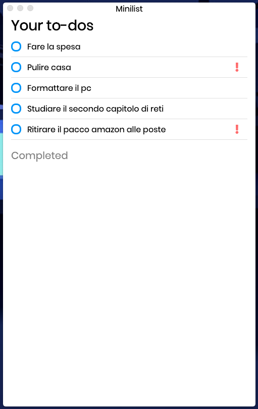
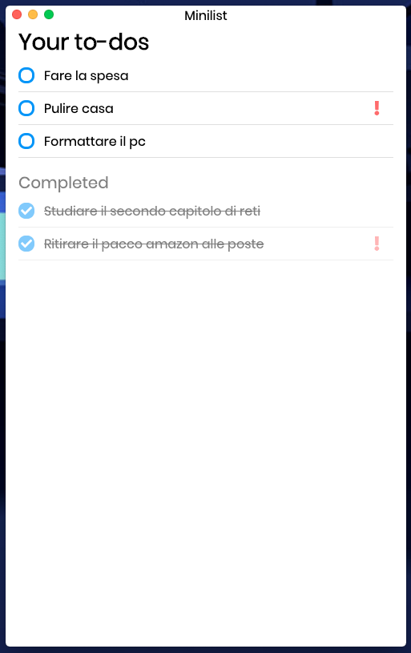
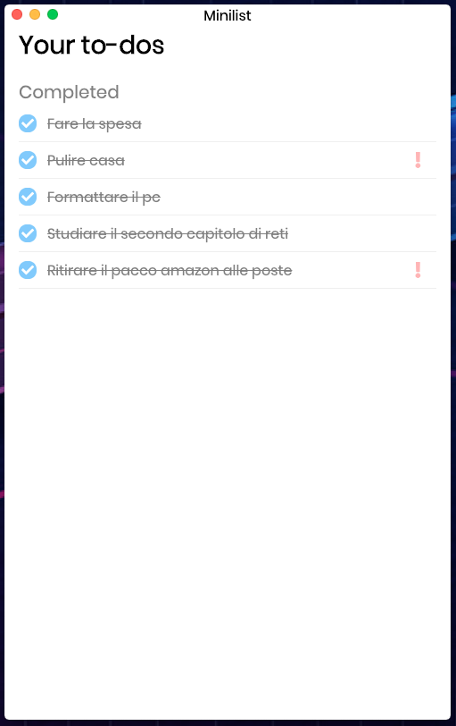

<p align="center">
   
</p>
<h1 align="center">Minilist</h1>
<h3 align="center">A simple and minimal to-do list built with VueJS and Electron</h3>
<p align="center">
   <p align="center"> 
      
      <a href="https://vuejs.org/">
         
      </a>
      <a href="https://vuejs.org/">
         
      </a>
      <a href="https://code.visualstudio.com/">
         
      </a>
   </p>
   <p align="center">
      <a href="https://lbesson.mit-license.org/">
         
      </a>
      
  </p>
</p>
</br>
</br>
<div>

</div>
</br>

#### Build Setup

```bash
# install dependencies
yarn install

# serve app with hot reload
yarn run dev

# build electron application for production
yarn run build

# lint all JS/Vue component files in `src/`
yarn run lint

```

---

This project was generated with [electron-vue](https://github.com/SimulatedGREG/electron-vue)@[45a3e22](https://github.com/SimulatedGREG/electron-vue/tree/45a3e224e7bb8fc71909021ccfdcfec0f461f634) using [vue-cli](https://github.com/vuejs/vue-cli). Documentation about the original structure can be found [here](https://simulatedgreg.gitbooks.io/electron-vue/content/index.html).
